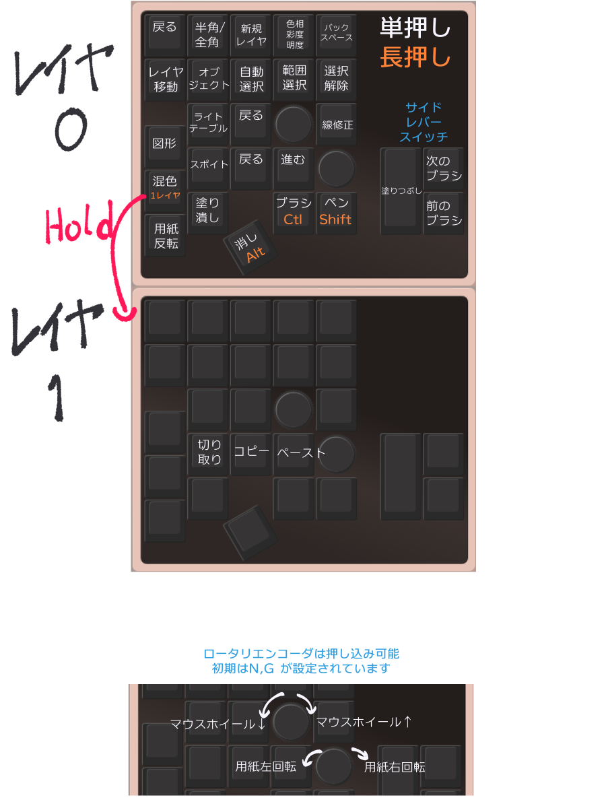

# xilefthand_keyboard

## 使い方
VIA を使ったマッピングについては「[（初心者編）VIAを使ってキーマップを書き換えよう](https://salicylic-acid3.hatenablog.com/entry/via-manual)」のページが非常に詳しくされていますので、参考にしてください。

このキーボードは VIA にキーマップがマージされていないため、 [リリースページから](https://github.com/XIpher-Desco/xilefthand_keyboard/releases) xileft_pad.json をダウンロードして、Designページからロードする必要があります。

付属の xileft_pad.layout.json は、デフォルトのキーマップです

## デフォルトキーマッピングのクリスタショートカット設定

